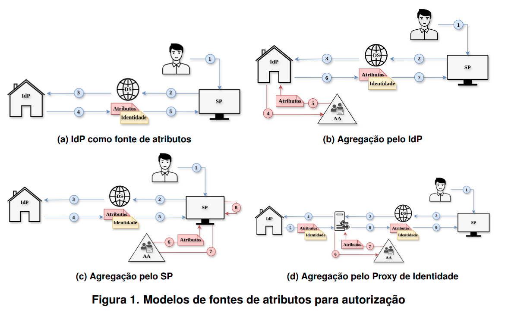
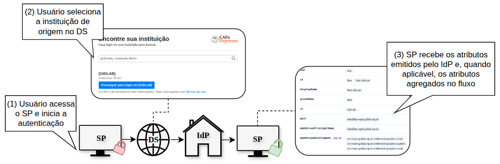

# atributos-wgid26

Ambiente de experimentação para avaliação de modelos de obtenção e agregação de atributos em autorização federada com SAML 2.0. Repositório de apoio ao artigo *"Avaliação Experimental de Estratégias de Agregação de Atributos em Federações Acadêmicas"*.

## Arquitetura

Quatro variações do mesmo fluxo SSO, diferindo no ponto em que os atributos de autorização são obtidos ou agregados:

<p align="center">
  
</p>

## Estrutura do repositório

- [`cenário-A/`](cenário-A/README.md): **IdP como fonte de atributos**. O IdP autentica o usuário e já entrega ao SP a asserção SAML com os atributos institucionais, sem consultar uma Autoridade de Atributos (AA).
- [`cenário-B/`](cenário-B/README.md): **Agregação pelo IdP**. O IdP consulta a AA e agrega os atributos complementares aos institucionais antes de gerar a asserção SAML.
- [`cenário-C/`](cenário-C/README.md): **Agregação pelo SP**. O IdP emite a asserção com os atributos básicos, e é o próprio SP quem consulta a AA e agrega os atributos complementares após recebê-la.
- [`cenário-D/`](cenário-D/README.md): **Agregação pelo proxy de identidade**. Um proxy de identidade (SATOSA) concentra a autenticação federada e a consulta a AA, entregando ao SP uma asserção já consolidada.

Cada diretório tem seu próprio `docker-compose.yaml`, `Caddyfile`,
`locust/` (scripts de carga) e `README.md` com detalhes de implementação
específicos daquele cenário. Consulte os links acima para mais
informações sobre um cenário em particular.

**Restrição operacional**: A, B, C e D reaproveitam o mesmo entityID,
hostname e porta do SP e do IdP, de modo que só um cenário fica de pé
por vez. Antes de subir um, derrube o anterior (`docker compose down`
no diretório correspondente).

## Execução

Antes de subir qualquer cenário, o `/etc/hosts` (ou DNS local) precisa
resolver para `127.0.0.1` os hostnames usados pelo cenário escolhido.
Sem esse passo, o navegador (ou o Locust) tenta resolver esses nomes
na internet e falha:

| Hostname | Necessário em |
|---|---|
| `idp-saml.gidlab.rnp.br` | A, B, C, D |
| `sp-saml.gidlab.rnp.br` | A, B, C, D |
| `aa-api.gidlab.rnp.br` | B, C, D |
| `proxy-wgid.gidlab.rnp.br` | D |

```bash
# clonar o repositório
git clone https://github.com/luizakuze/atributos-wgid26    

# subir a instância do cenário escolhido
cd atributos-wgid26/cenário-X
docker compose up --build    
# testar em https://sp-saml.gidlab.rnp.br

 # antes de subir outro cenário
docker compose down   
```
O IdP Shibboleth demora alguns segundos a mais que os outros
serviços para terminar de subir, porque a JVM do Jetty ainda precisa
compilar e implantar o webapp. Antes de testar manualmente, espere a
linha `Started` do Jetty aparecer no log.

Uma execução bem sucedida do fluxo consiste em acessar
`https://sp-saml.gidlab.rnp.br` (SP), seguir o fluxo de autenticação
federada, ao ser redirecionado ao DS externo da CAFe Expresso
(federação de experimentação) selecionar o IdP do ambiente
("Instituição WGID"), autenticar-se com `bob`/`bob` e retornar ao SP
com a decisão de acesso baseada nos atributos recebidos, mostrando
então os atributos recebidos.

<p align="center">
  
</p>

Esse fluxo de execução é o mesmo, de forma visual, nos quatro
cenários; o que muda entre eles é onde e como esses atributos
complementares são obtidos e agregados por trás dessa mesma tela
final, conforme descrito na arquitetura de cada um.

Para coletar as métricas descritas no artigo com o Locust, recomenda-se executar o script disponibilizado na raiz do repositório:

```bash
./run_all_locust.sh            # roda A, B, C, D nessa ordem
./run_all_locust.sh B D        # roda só os cenários passados, na ordem dada
```

O script sobe cada cenário, aguarda o SP e o IdP responderem, roda o
Locust até completar `LOCUST_TARGET_ITERATIONS` execuções (padrão 100)
já em regime estacionário e derruba o ambiente antes do próximo. Gera
os CSVs em `cenário-X/locust/resultados_x_clean_*.csv`, cujos campos
estão detalhados na seção Tecnologias e Metodologia, acima.

## Tecnologias e Metodologia

### Tecnologias

* **IdP**: Shibboleth IdP 3.4.3, com autenticação via LDAP (`osixia/openldap`, usuário `bob`/`bob`). Sua URL é `https://idp-saml.gidlab.rnp.br/idp/shibboleth`.

* **AA**: API REST em FastAPI, disponível no endpoint `GET /attributes/{uid}`, sem autenticação, responsável por retornar o atributo `eduPersonEntitlement`. Esse atributo do esquema `eduPerson` é usado para representar direitos de autorização como URIs, por exemplo: `urn:mace:gidlab.rnp.br:entitlement:projeto-a:read`.

  A AA complementa os atributos institucionais (`uid`, `cn`, `mail`, `eduPersonPrincipalName`) que o IdP já libera via LDAP em todos os cenários. Ela não é uma entidade SAML, e sua URL é `https://aa-api.gidlab.rnp.br`.

  O mecanismo técnico de agregação, ou seja, onde e como esse atributo é obtido e combinado aos atributos institucionais, é específico de cada modelo. Para mais detalhes, consulte o README de cada cenário.

* **SP**: aplicação Flask com `python3-saml` (`sp-saml/app.py`), responsável por consumir as respostas SAML emitidas pelo IdP ou pelo proxy. Seu entityID é `https://sp-saml.gidlab.rnp.br/saml/metadata`, e sua URL base é `https://sp-saml.gidlab.rnp.br`.

* **Proxy**: utilizado apenas no cenário D, com SATOSA (`pysaml2`). Atua como SP perante o IdP de origem e como IdP perante o SP real, permitindo a agregação de atributos no próprio proxy antes da emissão da asserção final ao SP. Seu entityID é `proxy-wgid.gidlab.rnp.br`, e sua URL base é `https://proxy-wgid.gidlab.rnp.br`.

* **DS (Serviço de Descoberta)**: WAYF da federação CAFe Expresso, disponível em `https://ds2.cafeexpresso.rnp.br/WAYF`. A CAFe Expresso é uma federação de experimentação baseada no modelo da CAFe (Comunidade Acadêmica Federada). Diferentemente dos demais componentes, o DS não foi executado localmente no ambiente experimental, sendo utilizado como serviço externo mantido pela infraestrutura da federação.

> **Nota sobre certificados**: o TLS de borda, provido pelo Caddy para os hostnames `*.gidlab.rnp.br`, utiliza um certificado wildcard real emitido pela RNP ICPEdu. Já os certificados de assinatura e criptografia SAML do IdP, do SP e, no cenário D, do proxy, são autoassinados por simplicidade neste ambiente de experimentação local. Por isso, é normal observar avisos de `self-signed certificate` nos logs do `xmlsec` ou do `python3-saml`. O fluxo continua funcionando porque a validação SAML utiliza o certificado presente na metadata, e não uma cadeia de confiança pública.

### Identificação do usuário para a AA

A AA é consultada pelo atributo `uid`, porém nem todo IdP real da
federação libera esse atributo nativamente (alguns liberam só
`eduPersonPrincipalName`, `mail` etc.). No IdP (cenário B) e no SP
(cenário C), quem consulta a AA trata isso de forma equivalente: busca
o `uid` recebido e, se ausente, simplesmente não consulta a AA, sem
interromper o fluxo (no B, isso na prática nunca ocorre, porque essa
agregação roda dentro do nosso próprio IdP, que sempre libera `uid`
via LDAP). No proxy (cenário D), a agregação roda num microsserviço
personalizado do SATOSA que pode autenticar contra qualquer IdP real
da federação, inclusive os que não liberam `uid`; nesse caso, o
identificador do usuário precisou ser construído a partir de
`eduPersonPrincipalName` (presente em toda a federação) em vez de
assumir `uid` sempre presente.

### Fase 1: instância-base (Locust)

A carga foi gerada com o [Locust](https://locust.io/), simulando o fluxo SAML completo de cada cenário como uma sequência de requisições HTTP (ver `locust/locustfile.py` de cada cenário), com 3 usuários simultâneos e aproximadamente 100 execuções completas por cenário (`LOCUST_TARGET_ITERATIONS≈100`). Os primeiros 15 segundos de cada execução foram descartados da medição (`LOCUST_WARMUP_SECONDS`), tempo suficiente para absorver a inicialização das entidades do fluxo (carregamento de classes da JVM do Shibboleth e estabelecimento do pool de conexões LDAP) sem contaminar as métricas em regime estacionário. Nas chamadas ao DS externo, o timeout de 60 segundos e as até 2 retentativas (`LOCUST_DS_TIMEOUT`/`LOCUST_DS_MAX_RETRIES`) absorvem oscilações reais de rede do WAYF de produção, evitando falsos negativos por lentidão alheia ao ambiente experimental. Os limites de CPU e memória foram mantidos idênticos nos quatro arquivos `docker-compose.yaml`; nenhuma falha foi registrada nos cenários avaliados.

O custo de autorização é obtido por requisição, do momento em que o
usuário recebe a tela de autenticação do IdP até a decisão final de
acesso, excluindo as mensagens de acesso ao SP, redirecionamento ao
DS e redirecionamento ao IdP (mensagens 1 a 3): essa parte inicial é
infraestrutura idêntica nos quatro cenários e depende de um WAYF
externo cuja latência não se relaciona a lógica de agregação. Na
Agregação pelo proxy, essa medição começa na mensagem 5, pois as
mensagens 3 e 4 ocorrem na mesma cadeia de redirecionamento HTTP e
não são isoláveis do lado do cliente.

A asserção ao SP é obtida na última `SAMLResponse` recebida pelo SP
antes da decisão de acesso, mesmo ponto nos quatro cenários. As
asserções são cifradas (XML Encryption); a comparação de tamanho é
feita sobre o bloco cifrado, sem inspeção direta dos atributos.

Os 3 usuários simultâneos autenticam-se com a mesma conta (`bob`/`bob`), porém cada um mantém uma sessão HTTP própria, equivalente a três sessões de navegador distintas: o Shibboleth associa o estado de sessão ao identificador de sessão (cookie), não a conta, e tanto o *bind* LDAP quanto a consulta a AA (um dicionário em memória, sem cache nem lock) têm custo constante por requisição, independente da identidade autenticada. O uso de uma única conta não introduz, portanto, viés na comparação de custo entre os modelos.

Ao final de cada rodada, o Locust grava 4 CSVs em `locust/` (prefixo `resultados_x_clean_`):

* **`_stats.csv`**: a tabela principal, com uma linha por etapa do fluxo (as etapas numeradas do cenário, mais CUSTO, TOTAL e tamanho da asserção) e uma linha `Aggregated`, com a contagem de requisições, falhas e os percentis de tempo de resposta (50% a 100%). É de onde vêm os números da Tabela 1.
* **`_stats_history.csv`**: a mesma tabela em série temporal, uma amostra a cada ~1s durante a rodada, útil para checar a estabilização das métricas após o período inicial descartado.
* **`_exceptions.csv`** e **`_failures.csv`**: ficam só com o cabeçalho quando não há erro; nos cenários avaliados, ambos vieram vazios.

### Fase 2: escalabilidade da federação (isolamento de rede Docker)

Como não há autenticação própria na AA, o controle de quem pode consultá-la é feito por segmentação de rede Docker: em cada `docker-compose.yaml` (B, C e D) existe uma rede `aa_internal` isolada da rede `default`, na qual só a AA e o componente que efetivamente a consulta (`shib-idp` em B, `sp-saml` em C, `satosa-proxy` em D) estão conectados. Os demais serviços do compose (`caddy`, `ldap` e, em D, o `shib-idp`/`sp-saml`) não têm rota de rede até a AA e falham por resolução de DNS ao tentar acessá-la.

Para simular o crescimento da federação sem executar o fluxo SAML completo em cada instituição nova, o ambiente foi estendido com componentes de rede adicionais na mesma topologia que uma instituição real ocuparia (dois IdPs extras em B, dois SPs extras em C, dois IdPs atrás do mesmo proxy em D). Como esses componentes entram na rede `default` (a mesma dos serviços legítimos que não consultam a AA) e não na `aa_internal`, o experimento mede, por inspeção de conectividade de rede, quantos componentes distintos ganham rota até a AA conforme $N$ cresce, sem precisar provisionar $N$ IdPs/SPs reais com Shibboleth completo. Comandos de verificação (`docker exec ... socket.gethostbyname('aa-api')`) e o detalhamento por cenário estão em [cenário-D/README.md](cenário-D/README.md#isolamento-de-rede-da-aa).


## Resultados

Tabela completa e discussão no artigo (Seção "Resultados e
Discussões").

### Fase 1: comparação dos quatro cenários

Resumo dos critérios avaliados:

| Critério | IdP como fonte | Agregação pelo IdP | Agregação pelo SP | Agregação pelo proxy |
|---|---:|---:|---:|---:|
| Custo de autorização (mediana, ms) | 39 | 65 | 64 | 150 |
| Mensagens no fluxo | 5 | 7 | 8 | 9 |
| Asserção ao SP (kB) | 12,8 | 13,5 | 12,8 | 10,9 |
| Número de entidades | 2 | 3 | 3 | 4 |
| Superfície de consulta a AA | não se aplica | IdP | SP | Proxy |
| Componentes sem consulta a AA | não se aplica | SP, DS | IdP, DS | SP, IdP, DS |

Como o custo de autorização e a asserção ao SP são obtidos está
descrito na Fase 1 da seção Tecnologias e Metodologia, acima. Os
valores refletem o processamento adicional exigido por cada
arquitetura. IdP como fonte tem o menor custo (39 ms) por não
consultar a AA. Agregação pelo IdP e agregação pelo SP têm custo
próximo entre si (65 e 64 ms) porque, em relação ao IdP como fonte,
acrescentam apenas uma consulta a AA sem reprocessar a asserção. O
proxy chega a 150 ms porque, além de consultar a AA, decodifica a
asserção recebida do IdP, agrega os atributos e gera e assina uma
nova asserção antes de entregá-la ao SP: etapas de processamento
ausentes nos demais modelos. Já o tamanho menor da asserção no proxy
(10,9 kB) decorre da serialização mais compacta da biblioteca
`pysaml2` usada pelo SATOSA, e não da arquitetura de agregação em si.

Os valores numéricos desta tabela vêm de uma execução já registrada
nos CSVs versionados em cada `cenário-X/locust/resultados_x_clean_*.csv`.
Reexecutar `./run_all_locust.sh` segue a mesma metodologia, mas os
valores absolutos podem variar conforme o hardware do host; o padrão
relativo entre os modelos é o que se espera manter.

### Fase 2: superfície de confiança da AA conforme a federação cresce

O ambiente foi estendido com componentes de rede adicionais: dois IdPs extras no cenário B, dois SPs extras no cenário C e dois IdPs extras atrás do mesmo proxy no cenário D. Esses componentes foram adicionados com a mesma topologia de rede que um componente real ocuparia, porém sem executar o fluxo SAML completo. O objetivo foi medir quantos componentes distintos possuem rota até a AA conforme aumenta o número de instituições participantes. Neste contexto, $N$ representa o número de instituições ou componentes participantes avaliados no experimento, enquanto $M$ representa um número genérico de instituições em uma federação de maior escala.

| Número de instituições | Agregação pelo IdP | Agregação pelo SP | Agregação pelo proxy |
| ---------------------- | -----------------: | ----------------: | -------------------: |
| $N=1$                  |                  1 |                 1 |                    1 |
| $N=3$                  |                  3 |                 3 |                    1 |
| $N=M$                  |                $M$ |               $M$ |                    1 |

Em B e C, cada instituição adicional exige uma nova rota de rede até a AA, resultando em crescimento linear (O(N)). No proxy, apenas o próprio proxy acessa diretamente a AA, independentemente do número de IdPs ou SPs conectados, mantendo o crescimento constante (O(1)).

## Considerações finais

A avaliação indica que o IdP como fonte única de atributos tem a menor complexidade arquitetural e o melhor desempenho (39 ms de custo de autorização), mas não atende cenários que dependem de atributos externos a instituição de origem; funciona, portanto, como linha de base para os demais modelos.

Nas agregações pelo IdP e pelo SP, o desempenho na Fase 1 ficou próximo entre si (65 e 64 ms), acima da linha de base pela consulta adicional a AA, mas a Fase 2 evidenciou uma limitação que a métrica de latência sozinha não captura: cada IdP, na agregação pelo IdP, ou cada SP, na agregação pelo SP, precisa manter sua própria integração com a AA e coordenar individualmente as políticas de liberação de atributos. Isso também aparece no esforço de implementação deste repositório: agregar pelo IdP exigiu um `ScriptedAttribute` no `attribute-resolver.xml` do Shibboleth (cenário B), e agregar pelo SP exigiu lógica equivalente em `sp-saml/app.py` (cenário C), ambos específicos de cada instância. Numa federação pequena esse custo de coordenação é gerenciável; numa federação do porte da [CAFe](https://rnpmais.rnp.br/comunidade-academica-federada-cafe), com mais de 320 instituições participantes e cerca de 2.500 serviços digitais integrados por login único, ele se torna uma carga distribuída entre todas as instituições e serviços conectados.

O proxy de identidade teve o maior custo de autorização (150 ms), decorrente do processamento adicional de decodificar, agregar e reassinar a asserção. Ainda assim, foi o único modelo que manteve constante o número de componentes com acesso a AA conforme a federação cresce, e a integração da AA ficou concentrada num único microsserviço do proxy (`aa_aggregation.py`, cenário D), sem exigir mudanças no IdP ou no SP. Esse resultado é consistente com a racionalidade do modelo de proxy descrito na [AARC Blueprint Architecture](https://aarc-community.org/architecture/) (projeto AARC, coordenado pela [GÉANT](https://wiki.geant.org/display/AARC/AARC+Architecture)): concentrar a agregação de atributos num proxy IdP/SP para que cada serviço não precise implementar suporte a múltiplas Autoridades de Atributos, recebendo identificadores e atributos já harmonizados.

Conclui-se que as abordagens pelo IdP ou pelo SP são adequadas para federações pequenas ou de baixa rotatividade de instituições, mas têm expansão limitada pela complexidade operacional distribuída entre IdPs ou SPs. Em federações acadêmicas amplas, como a CAFe, o proxy se mostra mais adequado quando a autorização depende de atributos de colaboração externos a instituição de origem: troca um custo de latência individual maior por uma superfície de consulta a AA constante e uma coordenação concentrada num único componente, geralmente operado pela própria federação.

