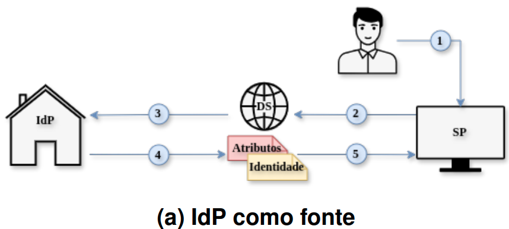

# Cenário A: IdP como fonte de atributos

## Fluxo

O cenário de IdP como fonte de atributos concentra no IdP tanto a função
de autenticação quanto a responsabilidade pelo fornecimento dos
atributos de autorização. Assim, atributos como identificadores, nome,
e-mail, vínculo institucional, grupos ou papéis previamente cadastrados
são transmitidos diretamente ao SP juntamente com a asserção de
autenticação. Como consequência, o fluxo possui menor número de
componentes especializados para agregação, mas exige que o IdP
mantenha e libere os atributos esperados por cada serviço.

<p align="center">
  
</p>


Representado na figura acima, o fluxo ocorre em cinco etapas: (1)
solicitação de acesso ao SP; (2) redirecionamento ao serviço de
descoberta (DS); (3) seleção do IdP de origem e autenticação do
usuário; (4) recuperação dos atributos institucionais e geração da
asserção SAML pelo IdP; e (5) recebimento da asserção pelo SP para
avaliação da política de acesso.

## Componentes implementados

- IdP Shibboleth
- Serviço de descoberta externo
- Provedor de serviços

## Ambiente de experimentação

Garanta que o arquivo `/etc/hosts` resolva os domínios
`idp-saml.gidlab.rnp.br` e `sp-saml.gidlab.rnp.br` para `127.0.0.1`.
Essa configuração precisa ser feita apenas uma vez.

O primeiro passo consiste em subir a composição para verificar o fluxo de
autenticação, de forma semelhante ao descrito no README principal:

```bash
cd cenário-A
docker compose up --build
```

O segundo passo da experimentação consiste na execução de um teste de carga,
que simula usuários concorrentes percorrendo o fluxo completo de
autenticação:

```text
SP → DS → IdP → SP
```

Durante a execução, são medidas as latências de cada etapa do fluxo.

Para iniciar o teste, execute:

```bash
cd locust
locust -f locustfile.py --host https://sp-saml.gidlab.rnp.br
```
