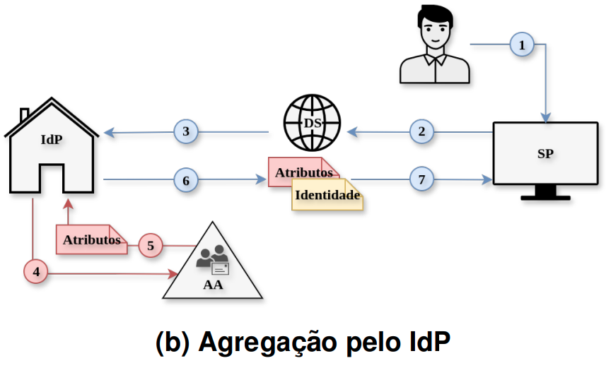

# Cenário B: Agregação pelo IdP

## Fluxo

Nesse cenário, a obtenção e a agregação dos atributos são realizadas
previamente pelo próprio IdP, sem que o SP precise interagir
diretamente com a AA. A consulta a AA pode ocorrer por meio de *SAML
Attribute Query*, conectores customizados, chamadas a APIs ou
consultas diretas a bases de dados e diretórios. Essa abordagem mantém
o SP mais simples, pois ele recebe uma única asserção SAML com o
conjunto final de atributos, mas aumenta a responsabilidade do IdP na
composição e liberação das informações de autorização.

<p align="center">
  
</p>


Representado na figura acima, o fluxo mantém as etapas comuns (1)–(3)
do Cenário A e segue com: (4) consulta do IdP a AA; (5) retorno dos
atributos da AA ao IdP; (6) agregação dos atributos externos aos
institucionais e geração da asserção SAML pelo IdP; e (7) recebimento
da asserção pelo SP para avaliação da política de acesso.

## Componentes implementados

- IdP Shibboleth (com lógica de agregação)
- Autoridade de Atributos 
- Serviço de descoberta externo
- Provedor de serviços

## Agregação da AA

A lógica de agregação está no `attribute-resolver.xml` do Shibboleth,
numa `AttributeDefinition` do tipo `ScriptedAttribute` (motor Nashorn)
que declara o próprio `eduPersonEntitlement`: toma o `uid` já resolvido
via LDAP como entrada, faz `GET http://aa-api:8000/attributes/{uid}`,
interpreta o JSON de resposta e popula os valores do atributo
(`eduPersonEntitlement.getValues().add(...)`) antes de ele ser
codificado na asserção SAML (`SAML2String`, OID
`urn:oid:1.3.6.1.4.1.5923.1.1.1.7`) e liberado ao SP pelo
`attribute-filter.xml`. A agregação acontece, portanto, dentro da
própria resolução de atributos do IdP, antes de a asserção existir.

## Ambiente de experimentação

Garanta que o arquivo `/etc/hosts` resolva os domínios
`idp-saml.gidlab.rnp.br`, `sp-saml.gidlab.rnp.br` e
`aa-api.gidlab.rnp.br` para `127.0.0.1`. Essa configuração precisa ser
feita apenas uma vez.

O primeiro passo consiste em subir a composição para verificar o fluxo de
autenticação, de forma semelhante ao descrito no README principal:

```bash
cd cenário-B
docker compose up --build
```

O segundo passo da experimentação consiste na execução de um teste de carga,
que simula usuários concorrentes percorrendo o fluxo completo de
autenticação e agregação de atributos:

```text
SP → DS → IdP → AA → IdP → SP
```

Durante a execução, são medidas as latências de cada etapa do fluxo.

Para iniciar o teste, execute:

```bash
cd locust
locust -f locustfile.py --host https://sp-saml.gidlab.rnp.br
```

## Isolamento de rede da AA

A rede `aa_internal` no `docker-compose.yaml` restringe o acesso a AA
apenas ao `shib-idp` (que a consulta no `attribute-resolver.xml`) e a
própria AA: `sp-saml`, `caddy` e `ldap` não têm rota até ela. O
experimento de superfície de confiança da AA em função do tamanho da
federação, que usa componentes adicionais nesse mesmo isolamento de
rede, está detalhado em
[cenário-D/README.md](../cenário-D/README.md#isolamento-de-rede-da-aa).
