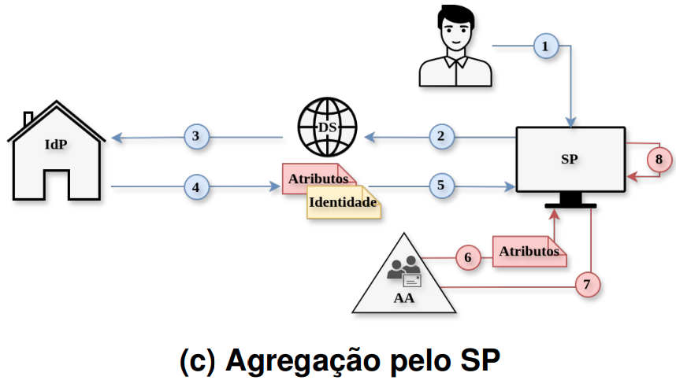

# Cenário C: Agregação pelo SP

## Fluxo

Nesse cenário, a agregação ocorre no lado do serviço, permitindo que o
SP recupere diretamente atributos específicos para sua política de
autorização, como permissões de projeto, papéis locais ou grupos
mantidos fora da instituição de origem. Essa abordagem reduz a
necessidade de o IdP conhecer atributos específicos de cada serviço,
mas aumenta a complexidade do SP, que passa a depender de integração
direta com a AA.

<p align="center">
  
</p>


Representado na figura acima, o fluxo mantém as etapas comuns (1)–(3)
e segue com: (4) emissão da asserção SAML inicial pelo IdP; (5) envio
da asserção ao SP; (6) consulta do SP a AA; (7) retorno dos atributos
ao SP; e (8) agregação local para avaliação da política de acesso.

O IdP autentica o usuário e emite uma asserção SAML apenas com os
atributos institucionais básicos (igual ao Cenário A, sem consultar a
AA). É o próprio SP quem consulta a Autoridade de Atributos (`aa-api`)
depois de receber a asserção, agregando os atributos complementares
(`eduPersonEntitlement`) localmente antes de decidir o acesso.

## Componentes implementados

- IdP Shibboleth 
- Serviço de descoberta externo
- Provedor de serviços (com lógica de agregação)
- Autoridade de Atributos  

## Agregação da AA

A lógica de agregação está em `sp-saml/app.py`, na rota `/saml/acs`.
Depois de processar a asserção do IdP (`auth.get_friendlyname_attributes()`,
só com os atributos institucionais), a função `fetch_aa_attributes(uid)`
faz `GET http://aa-api:8000/attributes/{uid}` e retorna o JSON da AA. O
próprio handler da rota funde os dois conjuntos num único dicionário
(`aggregated_attributes = dict(saml_attributes)`, sobrescrito com as
chaves vindas da AA) e guarda o resultado na sessão (`samlUserdata`).
A agregação acontece, portanto, depois de a asserção já existir, no
lado do serviço.

## Ambiente de experimentação

Garanta que o arquivo `/etc/hosts` resolva os domínios
`idp-saml.gidlab.rnp.br`, `sp-saml.gidlab.rnp.br` e
`aa-api.gidlab.rnp.br` para `127.0.0.1`. Essa configuração precisa ser
feita apenas uma vez.

O primeiro passo consiste em subir a composição para verificar o fluxo de
autenticação, de forma semelhante ao descrito no README principal:

```bash
cd cenário-C
docker compose up --build
```

O segundo passo da experimentação consiste na execução de um teste de carga,
que simula usuários concorrentes percorrendo o fluxo completo de
autenticação e agregação de atributos:

```text
SP → DS → IdP → SP → AA → SP
```

Durante a execução, são medidas as latências de cada etapa do fluxo.

Para iniciar o teste, execute:

```bash
cd locust
locust -f locustfile.py --host https://sp-saml.gidlab.rnp.br
```

## Isolamento de rede da AA

A rede `aa_internal` no `docker-compose.yaml` restringe o acesso a AA
apenas ao `sp-saml` (que a consulta em `fetch_aa_attributes()`) e a
própria AA: `shib-idp`, `caddy` e `ldap` não têm rota até ela. O
experimento de superfície de confiança da AA em função do tamanho da
federação, que usa componentes adicionais nesse mesmo isolamento de
rede, está detalhado em
[cenário-D/README.md](../cenário-D/README.md#isolamento-de-rede-da-aa).
