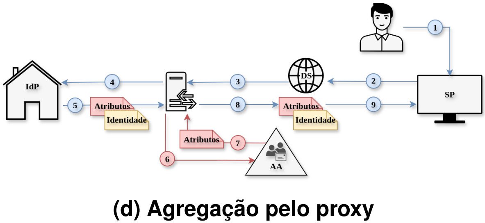

# Cenário D: Agregação pelo proxy de identidade

## Fluxo


Nesse cenário, o SP não precisa interagir diretamente com a AA nem
conhecer os detalhes de integração com os diferentes IdPs e fontes de
atributos. A responsabilidade pela obtenção, normalização e agregação
dos atributos fica concentrada no proxy, o que reduz o acoplamento
entre SPs e fontes de atributos, mas introduz um componente
intermediário adicional no fluxo federado.

<p align="center">
  
</p>


Representado na figura acima, o fluxo ocorre em nove etapas: (1)
solicitação de acesso ao SP; (2) redirecionamento ao DS; (3) envio da
requisição ao proxy; (4) redirecionamento ao IdP e autenticação do
usuário; (5) envio da asserção SAML ao proxy; (6) consulta do proxy a
AA; (7) retorno dos atributos ao proxy; (8) agregação dos atributos e
geração de resposta consolidada; e (9) recebimento pelo SP para
avaliação da política de acesso.

O proxy concentra a autenticação federada e a agregação de atributos:
o IdP autentica o usuário e envia ao proxy uma asserção com identidade
e atributos institucionais básicos; o proxy consulta a Autoridade de
Atributos (`aa-api`), agrega tudo e só então entrega ao SP uma
asserção final consolidada. As mensagens 3 e 4 (DS direciona ao proxy
/ proxy redireciona ao IdP) ocorrem na mesma cadeia de redirecionamento
HTTP e não são isoláveis do lado do cliente; por isso a métrica de
custo de agregação deste cenário é medida a partir da mensagem 5, não
da 4 como nos demais cenários.

## Componentes implementados

- Proxy [SATOSA](https://github.com/IdentityPython/SATOSA)
  (`satosa-proxy/`), com as seguintes configurações:

  - Backend SAML2 (`satosa/etc/plugins/backends/saml2_backend.yaml`): o proxy atua como SP em relação ao IdP de origem. Os metadados dos IdPs são obtidos de duas fontes: da federação CAFe Expresso, por meio da URL `https://ds2.cafeexpresso.rnp.br/metadata/ds-metadata.xml`, configurada como fonte remota no SATOSA, e do arquivo local `idp.xml`, que descreve o `shib-idp` usado no ambiente de testes. 

  - Frontend SAML2 (`satosa/etc/plugins/frontends/saml2_frontend.yaml`): o proxy atua como IdP em relação ao SP real. Nessa etapa, ele recebe os atributos vindos do backend e dos microservices, monta a resposta SAML final e a entrega ao SP.


  - Microservice `IdpHinting` (`satosa/etc/plugins/microservices/idp_hinting.yaml`): microservice nativo do SATOSA que lê o `entityID` do IdP informado no parâmetro `idp_hint` da URL. Esse parâmetro corresponde ao IdP escolhido pelo usuário na WAYF e repassado pelo SP. Com isso, o proxy encaminha a autenticação diretamente para o IdP selecionado.


  - Microservice próprio (`satosa/etc/plugins/microservices/aa_aggregation.py`): consulta a AA via REST e injeta o atributo `eduPersonEntitlement` na resposta antes de ela seguir para o SP.
- IdP Shibboleth
- Autoridade de Atributos
- Serviço de descoberta externo
- Provedor de serviços


## Agregação da AA

A lógica de agregação está no `AaAttributeAggregation`
(`ResponseMicroService` do SATOSA). Depois que o backend recebe do
IdP real a resposta com os atributos institucionais básicos, o
microservice busca o `uid` entre esses atributos. Caso ele esteja presente,
é realizada uma requisição `GET {aa_base_url}/attributes/{uid}`. Se a AA
retornar o atributo `eduPersonEntitlement`, seus valores são gravados em
`data.attributes` antes de a resposta ser repassada ao frontend, que gera a
asserção final para o SP.

A agregação acontece, portanto, dentro do próprio proxy, entre o backend e o
frontend, sem que o IdP real ou o SP precisem conhecer ou consultar
diretamente a AA.

## Ambiente de experimentação

Garanta que o arquivo `/etc/hosts` resolva os domínios
`idp-saml.gidlab.rnp.br`, `sp-saml.gidlab.rnp.br`,
`aa-api.gidlab.rnp.br` e `proxy-wgid.gidlab.rnp.br` para `127.0.0.1`.
Essa configuração precisa ser feita apenas uma vez.

O primeiro passo consiste em subir a composição para verificar o fluxo de
autenticação, de forma semelhante ao descrito no README principal:

```bash
cd cenário-D
docker compose up --build
```

O segundo passo da experimentação consiste na execução de um teste de carga,
que simula usuários concorrentes percorrendo o fluxo completo de autenticação
e agregação de atributos:

```text
SP → DS → Proxy → IdP → Proxy → AA → Proxy → SP
```

Durante a execução, são medidas as latências de cada etapa do fluxo.

Para iniciar o teste, execute:

```bash
cd locust
locust -f locustfile.py --host https://sp-saml.gidlab.rnp.br
```

## Isolamento de rede da AA

A AA (`aa-api`) não tem autenticação própria; o isolamento de acesso é
feito por segmentação de rede Docker. Cada `docker-compose.yaml` (B, C
e D) tem uma rede `aa_internal` que só a AA e o componente que
efetivamente a consulta compartilham:

| Cenário | Quem tem rota até a AA | Quem foi bloqueado |
|---|---|---|
| B | `shib-idp` | `sp-saml`, `caddy`, `ldap` |
| C | `sp-saml` | `shib-idp`, `caddy`, `ldap` |
| D | `satosa-proxy` | `shib-idp`, `sp-saml`, `caddy`, `ldap` |

Verificação (mesmo padrão nos três, comandos completos nos READMEs de
B/C):

```bash
# componente sem rota
docker exec sp-saml-case-d python3 -c "import socket; socket.gethostbyname('aa-api')"
# -> socket.gaierror: [Errno -2] Name or service not known

# componente com rota
docker exec satosa-proxy-case-d python3 -c \
  "import requests; print(requests.get('http://aa-api:8000/attributes/bob').json())"
# -> HTTP 200
```

### Superfície de confiança conforme a federação cresce

Com um único IdP e um único SP, os três modelos com AA empatam em "1
componente com acesso", o que não representa uma federação real com
várias instituições. Para medir isso, o ambiente foi estendido com
componentes de rede adicionais (dois IdPs em B, dois SPs em C, dois
IdPs atrás do mesmo proxy em D, na mesma topologia de rede que um
componente real ocuparia, sem fluxo SAML completo):

| Cenário | Componentes com acesso a AA ($N=1$) | Componentes com acesso a AA ($N=3$) |
|---|---:|---:|
| B | 1 (`shib-idp`) | 3 (`shib-idp` + 2 stubs) |
| C | 1 (`sp-saml`) | 3 (`sp-saml` + 2 stubs) |
| D | 1 (`satosa-proxy`) | 1 (`satosa-proxy`, sem mudança) |

Em B e C, cada IdP/SP novo exige a própria rota de rede até a AA: a
superfície de acesso cresce linearmente com o número de instituições
(O(N)). Em D, os IdPs adicionais (mesma rede `default` que o
`shib-idp` real) permanecem sem qualquer rota até a AA: apenas o
proxy, que está na rede `aa_internal`, tem acesso, independentemente
de quantos IdPs entrem atrás dele (O(1)).

Numa federação real, essa mesma lógica se aplica a relações de
confiança e regras de firewall, não só a redes Docker: em B e C, quem
administra a AA precisa manter uma lista de acesso crescendo a cada
instituição nova (todo IdP em B, todo SP em C); em D, a AA só precisa
liberar acesso para o proxy, tipicamente operado pela própria
federação, como o `proxy.gidlab.rnp.br` real da RNP.
